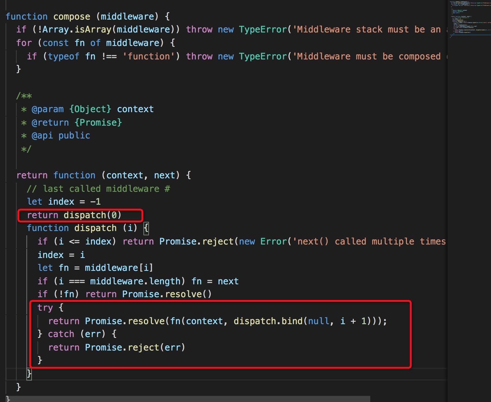

### 解析 koa 中间件

什么是中间件？
通俗的讲，中间件就是匹配路由之前或者匹配路由完成做的一系列操作，我们就可以把它叫做中间件

经典的洋葱模型：


#### 代码运行

```
执行node index.js
```

浏览器中输入[localhost: 3000](http://localhost:3000/)

输出结果

完美展示了洋葱模型的执行顺序

### 源码解析

打断点调试
app.use 方法 源码如下：

```
use(fn) {
    if (typeof fn !== 'function') throw new TypeError('middleware must be a function!');
    if (isGeneratorFunction(fn)) {
      deprecate('Support for generators will be removed in v3. ' +
                'See the documentation for examples of how to convert old middleware ' +
                'https://github.com/koajs/koa/blob/master/docs/migration.md');
      fn = convert(fn);
    }
    debug('use %s', fn._name || fn.name || '-');
    this.middleware.push(fn);
    return this;
  }
```

这个方法主要执行的就是`this.middleware.push(fn);` 将中间件 push 到一个中间件数组

然后在 app.listen 里面

```
 listen(...args) {
    debug('listen');
    const server = http.createServer(this.callback());
    return server.listen(...args);
}
```

执行 node 的 http server, 然后看 this.callback 函数

```
  callback() {
    const fn = compose(this.middleware);

    if (!this.listenerCount('error')) this.on('error', this.onerror);

    const handleRequest = (req, res) => {
      const ctx = this.createContext(req, res);
      return this.handleRequest(ctx, fn);
    };

    return handleRequest;
  }
```

this.callback 函数里面, 对 middleware 数组执行 compose 方法，进入 compose

可以看到 next 就是 middleware[i+1],即中间件数组中的下一个中间件，所以执行在中间件中执行 next 方法，实际上就是执行下一个中间件

### 常用中间件

- [koa-bodyparser](https://github.com/koajs/bodyparser):request body 的解析器
- [koa-router](https://github.com/ZijianHe/koa-router): 路由中间件
- [koa-static](https://github.com/koajs/static): 静态资源中间件
- [koa-session](https://github.com/koajs/session): session 中间件
- [koa-views](https://github.com/queckezz/koa-views#readme): 渲染模板引擎中间件
